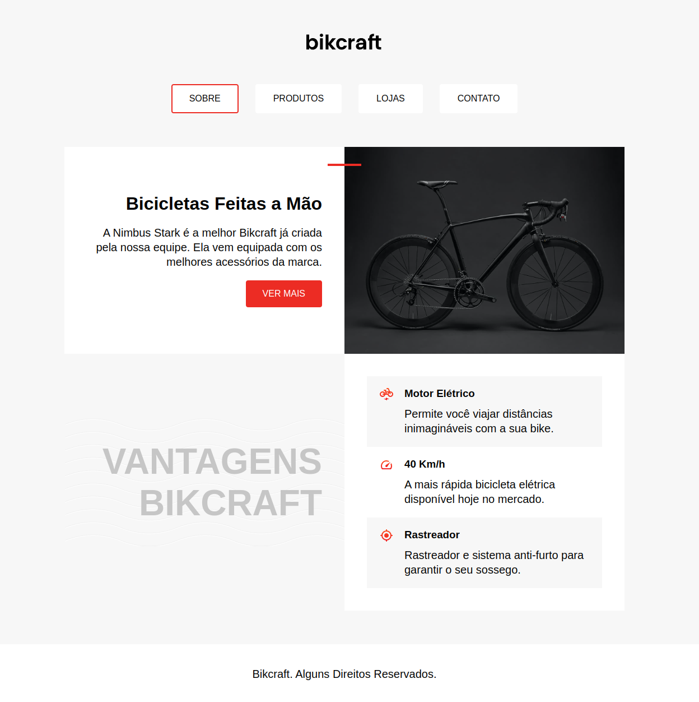

# bikcraft-refactoring

## Exercício de refatoração do projeto Bikcraft desenvolvido durante o curso de frontend da Origamid

Este é um projeto desenvolvido para fins didáticos e está em constante aprimoramento conforme novas habilidades são aprendidas por mim.

Link para o projeto no [Vercel](https://bikcraft-refactoring.vercel.app).

